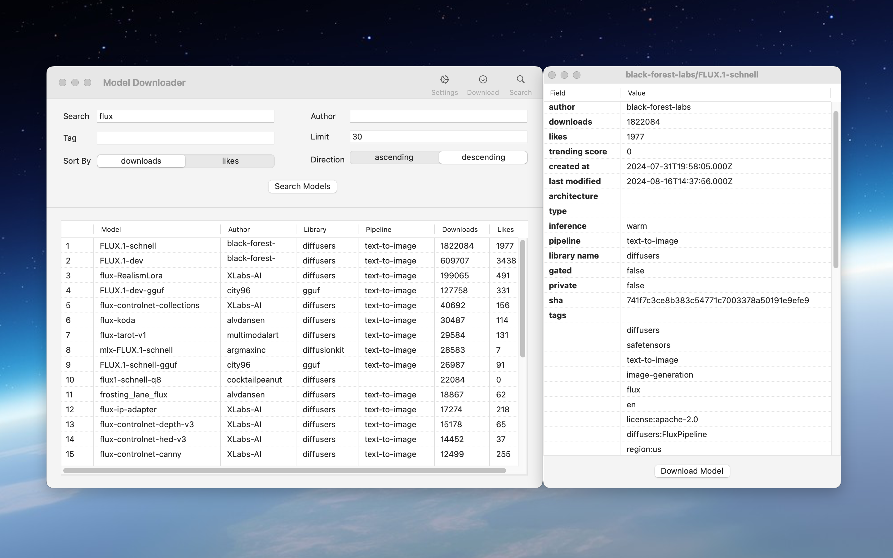

# HuggingFace LLM model downloader

[Click](https://github.com/ymtagi/HuggingFaceModelDownloader/releases/download/release%2F1.0/ModelDownloader.zip) to download ModelDownloader

## Overview

HuggingFace large language models downloader for macOS, simple & powerful.

## Features

A simple & powerful downloader for downloading various large language models from huggingface.co

- search models on huggingface.co by model name, author, tags
- provide your own huggingface token to download the 'gated models'
- one click to download all the associated model files of a model
- supports resuming downloading from breakpoints
- application supports dark & light theme

## Product Screenshots

#### Model Search

You can search models on hugging-face.co by name/author/tag.

---

#### Model Details

You can view the model details by double click each model.

---

#### Model Download

Automaticly download all the files of a LLM model.

---

## Note
If you want to download the **gated model** from hugging-face.co, then you need to set your hugging-face access token in `Settings`, and also in the model card page you need to agree to share your contact information to access this model. Please follow the instructions to download **gated model** on hugging-face.co: [Meta-Llama-3.1-8B-Instruct](https://huggingface.co/meta-llama/Meta-Llama-3.1-8B-Instruct)

---

© 2024 YMTECH. All rights reserved.
